## Introdução

O objetivo deste projeto é realizar a clusterização (agrupamento) de jogadores de Rocket League®, um jogo de futebol com carros onde ambas as equipes possuem três jogadores, com base em suas estatísticas de partidas competitivas da RLCS 2021-22 (Rocket League Championship Series). Para isso, foi utilizado o algoritmo KMeans da biblioteca Scikit-learn, além do Pandas, outra biblioteca da linguagem Python.

O KMeans foi utilizado pois é um algoritmo de clusterização muito popular e eficiente, além de ser fácil de implementar. E o Pandas foi utilizado para manipular os dados, como preencher valores nulos, remover colunas, agrupar dados, etc.

Versão do Python: 3.9.12

## Dados

Algumas modificações foram feitas no dataset. Os dados podem ser encontrados no link: https://www.kaggle.com/datasets/dylanmonfret/rlcs-202122/data

## Pré-processamento

O dataset foi pré-processado para que fosse possível realizar a clusterização.

As colunas que continham valores nulos foram preenchidas com a média e mediana dos valores da coluna conforme necessário:

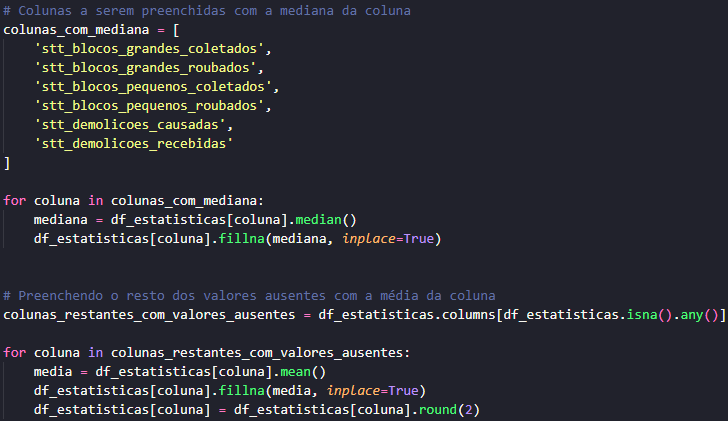

A coluna de ID de jogos foi removida, pois não deve ser utilizada para a clusterização, a coluna de ID de jogadores foi usada para agrupar a média das estatísticas de cada jogador, e todas as colunas tiveram os valores arredondados para duas casas decimais:

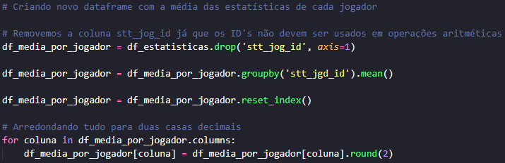

A coluna de ID de jogadores foi temporariamente removida para que a clusterização fosse realizada, mais tarde ela será necessária para realizar a análise dos clusters:

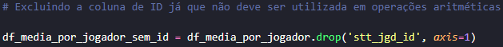

Foi criado um padronizador de dados pois o algoritmo KMeans espera receber dados que estejam na mesma escala, para isso, foi utilizado o StandardScaler da biblioteca Scikit-learn:

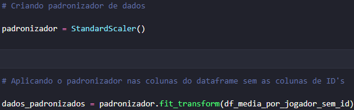

## Criação do modelo de clusterização

Os dados não foram divididos em dados de treino e teste por causa da baixa quantidade de dados.

A quantidade de clusters foi definida como 3, pois como mencionado anteriormente, cada equipe possui três jogadores:

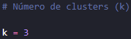

O modelo foi criado e a quantidade de clusters foi passada como parâmetro:

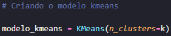

E finalmente, o modelo foi treinado com os dados padronizados:

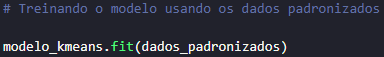

Além disso, foi criado um novo dataframe com as estatísticas e os clusters que cada jogador foi atribuído:

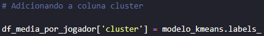

## Análise dos clusters

Um dashboard no Power BI foi criado para analisar os clusters:

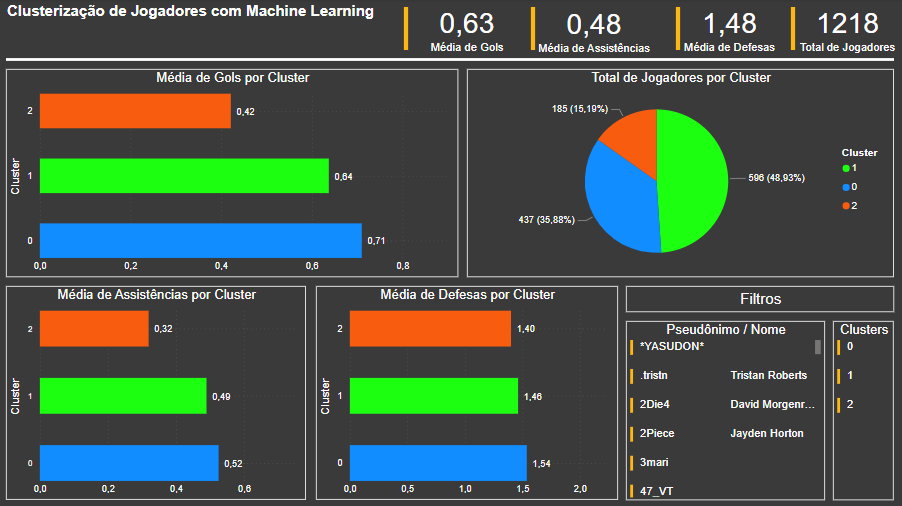

## Conclusão

Este projeto mostra o potencial do algoritmo KMeans para realizar a clusterização de jogadores de Rocket League com base em suas estatísticas de partidas, e as expectativas iniciais foram atendidas.

Com base na análise dos clusters foi possível perceber que, de forma geral, o cluster 0 contém jogadores que tiveram um desempenho acima da média, o cluster 1 contém jogadores que tiveram um desempenho mediano, e o cluster 2 contém jogadores que tiveram um desempenho abaixo da média. No geral, é possível afirmar que cada cluster indica a relevância que cada jogador teve durante as competições.

Para comparação, é possível analisar o rank dos top 20 jogadores de 2022 fornecido pela fonte ShiftRL:

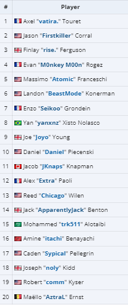

Link: https://liquipedia.net/rocketleague/Shift/Top_20_Players

E podemos observar qual cluster cada jogador desse rank foi atribuído:

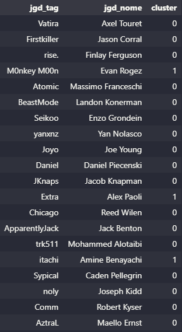

Apenas 3 jogadores do top 20 foram atribuídos ao cluster 1, enquanto 17 jogadores foram atribuídos ao cluster 0 e nenhum jogador foi atribuído ao cluster 2. 

Lembrando que o algoritmo não leva em consideração a consistência dos jogadores, apenas as estatísticas das partidas, então provavelmente alguns jogadores (aqueles que não estavam entre os 20 jogadores de 2022) foram atribuídos ao cluster 0 por terem tido um alto desempenho em poucas partidas, mas não foram relevantes durante toda a competição.